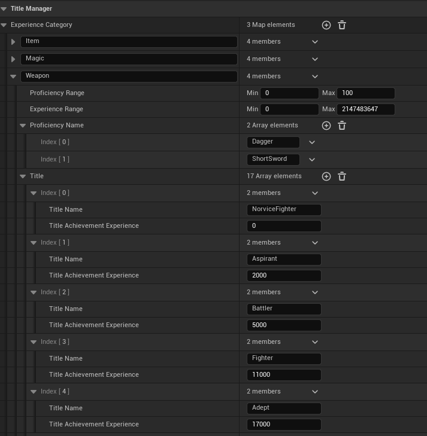
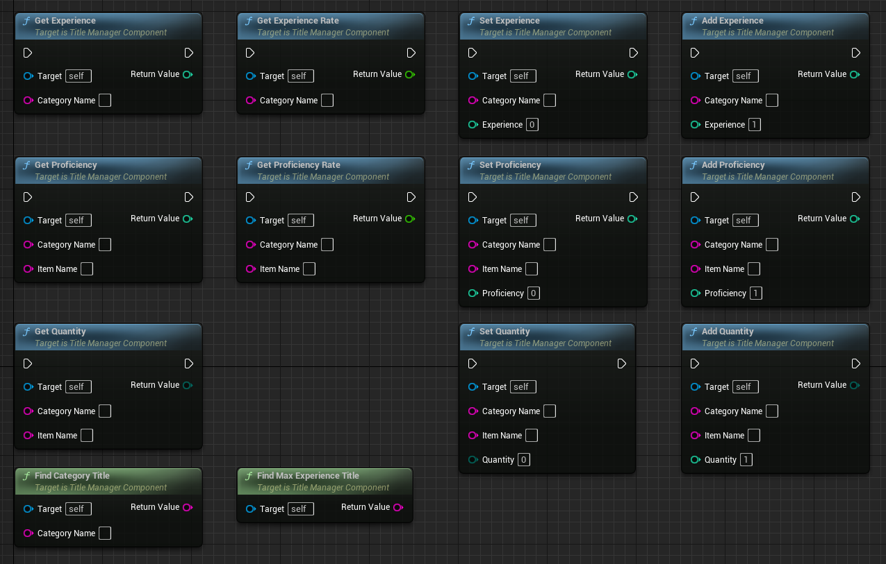

<h1>TitleManager for UE5</h1>

# Engilish
## Title Manager Plugin for Unreal Engine

Keeps track of the proficiency level of each tool and the experience level of the tool's category.
When a tool is used, the tool's proficiency level and the experience value of the category to which it belongs are added.
The title changes when the experience value exceeds the value required for the title.
Tools can be equipment such as weapons and armor, items such as medicines, and maybe even a little naughty tools.

## Create TitleManagerDatabase.

* Right click in the content browser.
* Select `TitleManager` and then `TitleManagerDatabase` to create the asset.
* Open the `TitleManagerDatabase` you created and set the experience, proficiency and title types.

## Add TitleManagerComponent.

* Add a `TitleManager` component to the actors for your game, such as `GameMode`, `GameState`, `PlayerState`, etc.
* Set the `TitleManagerDatabase` to the Database of the `TitleManager` component.
* Use the following commands as needed.

# 日本語
## 称号マネージャプラグイン for Unreal Engine

道具毎の熟練度と道具のカテゴリの経験値を記録します。
道具を使うと道具の熟練度と所属するカテゴリの経験値が加算します。
経験値が称号に必要な値を超えると称号が変わります。RPG以外にアドベンチャーゲームや育成系ゲームにも使えそう
道具は武器や防具などの装備品でも良いし、薬などのアイテムでも良いし、もしかしたらちょっぴりエッチな道具でも良いかもしれない。

## TitleManagerDatabaseの作成

* コンテンツブラウザ内で右クリックします。
* `TitleManager`から`TitleManagerDatabase`を選択してアセットを作成します。
* 作成した`TitleManagerDatabase`を開いて経験値や熟練度、称号の種類を設定して下さい。

## TitleManagerComponentの追加

* `GameMode`や`GameState`、`PlayerState`などゲームの内容に合わせたアクターに`TitleManager`コンポーネントを追加します。
* `TitleManager`コンポーネントのDatabaseにTitleManagerDatabaseを設定します。
* 必要に応じて以下の命令を使用して下さい。

# 👾 Authors
* [Nonbiri](https://www.youtube.com/channel/UCkLXe57GpUyaOoj2ycREU1Q)
* [Shun Moriya](https://x.com/shun_moriya)

